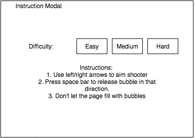
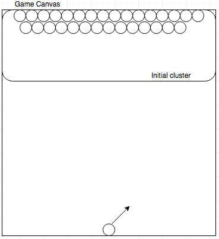

# Bubbles

[github link][github]

[github]: www.github.com

## Minimum Viable Product

Bubbles is a JavaScript game based on bubble shooter. Players must burst clusters of bubbles on top with the same color and prevent the whole page from filling with bubbles.

### Features
- Bubble clusters at the top
- Next bubble random.
- Shooter that is controlled with left/right arrows to aim
- Modal at beginning to describe and how-to-play game
- Difficulty selector (easy, medium, hard); how fast a new row is added.
- (BONUS) Two player battle.

### Technologies
- Vanilla JavaScript
- Canvas

## Wireframes

## Implementation Timeline

### Phase 1: Creating clusters of bubbles at top of screen (1 day, W 6pm)

**Objective:** Initializing clusters of bubbles at the top and timed interval for adding new row of bubbles.

- [ ] Modal to explain game
- [ ] Create row of bubbles
- [ ] Create clusters of bubbles
- [ ] Set timer for adding new rows

### Phase 2: Design shooter (1 day, Th 6pm)

**Objective:** Shooter is able to aim left/right in a semi-circle

- [ ] Detect arrow key strokes to aim shooter
- [ ] Shoot bubble and attach itself to a bubble it first touches
- [ ] Bubble to shoot is randomly chosen

### Phase 3: Popping/Exploding bubbles (1 day, Fr 6pm)

**Objective:** Cluster of bubbles explodes when a bubble of the same color touches it.

- [ ] Detect when a new bubble touches to the cluster
- [ ] Exploding animation

## Checklist

### Live Project

* [ ] Includes links to your Portfolio, Github and LinkedIn.
* [ ] Landing page/modal with obvious, clear instructions.
* [ ] Interactivity of some kind.
* [ ] Well styled, clean frontend.
* [ ] If it has music, the option to mute or stop it.
* [ ] Hosted from your portfolio site on [GitHub pages](https://pages.github.com/).

### Repo and [README][readme-guide]

* [ ] Link to live version.
* [ ] Instructions on how to play/use the project.
* [ ] List of techs/languages/plugins/APIs used.
* [ ] Technical implementation details with code snippets (make sure it looks good).
* [ ] To-dos/future features.
* [ ] No .DS_Stores / debuggers / console.logs.
* [ ] Organize into /assets and /lib.
